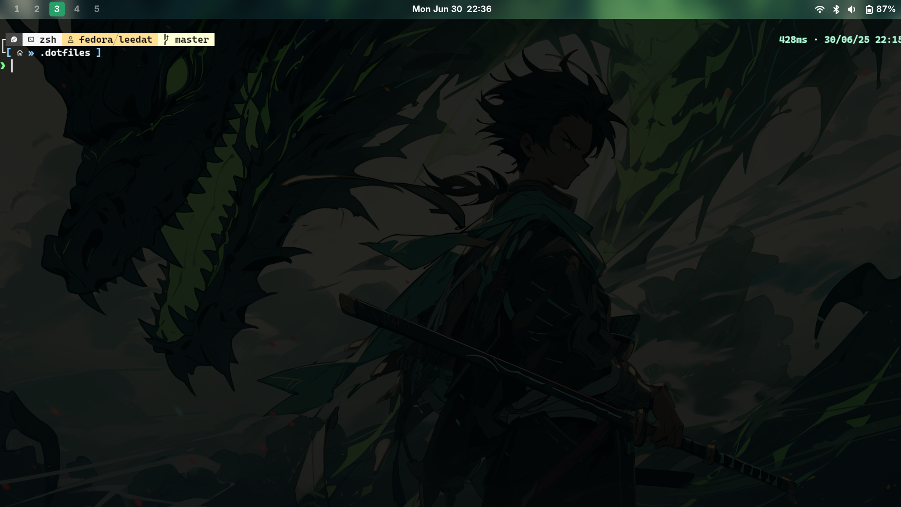
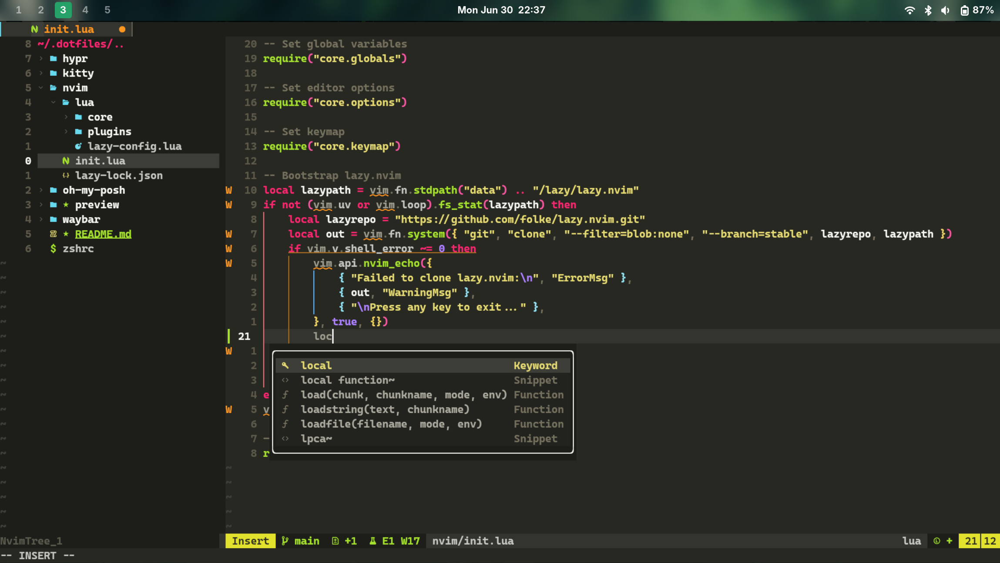

# 🏠 Dotfiles Configuration

A modern Linux development environment setup featuring carefully curated tools and configurations for a productive development workflow.

## 📸 Preview

This configuration provides a clean, modern terminal and editor environment optimized for development work with beautiful aesthetics and smooth workflow.

### Terminal Environment



### Neovim Setup



## 🛠️ Tech Stack

- **Terminal**: [Kitty](https://sw.kovidgoyal.net/kitty/) - GPU-accelerated terminal emulator
- **Shell**: [Zsh](https://www.zsh.org/) with [Oh My Zsh](https://ohmyz.sh/)
- **Prompt**: [Oh My Posh](https://ohmyposh.dev/) with custom theme
- **Editor**: [Neovim](https://neovim.io/) with [Lazy.nvim](https://github.com/folke/lazy.nvim) plugin manager
- **Color Scheme**: Everforest theme across all applications
- **Package Manager**: [Homebrew](https://brew.sh/) for Linux

## 🚀 Features

### 🖥️ Terminal Setup

- **Kitty terminal** with CaskaydiaCove Nerd Font
- **Powerline-style tabs** with slanted design
- **Optimized font rendering** with 110% line height
- **Custom cursor** and color scheme

### 💻 Shell Environment

- **Zsh with Oh My Zsh** framework
- **Enhanced plugins**:
  - `git` - Git integration and aliases
  - `zsh-syntax-highlighting` - Command syntax highlighting
  - `zsh-autosuggestions` - Intelligent command suggestions
- **Carapace completion** engine for enhanced tab completion
- **Custom Oh My Posh theme** (`hul10-custom`)

### ⚡ Neovim Setup

- **Lazy.nvim** plugin manager for fast startup
- **Modular configuration** structure:
  - Core settings (globals, options, keymaps)
  - Plugin configurations (LSP, treesitter, UI, etc.)
  - Coding enhancements (formatting, linting)
  - File explorer (nvim-tree)
- **LSP integration** for intelligent code editing
- **Treesitter** for enhanced syntax highlighting

## 📁 Directory Structure

```
.dotfiles/
├── README.md                 # This file
├── zshrc                     # Zsh configuration
├── kitty/                    # Kitty terminal configuration
│   └── kitty.conf           # Terminal settings
├── nvim/                     # Neovim configuration
│   ├── init.lua             # Main Neovim entry point
│   ├── lazy-lock.json       # Plugin version lock file
│   └── lua/                 # Lua configuration modules
│       ├── lazy-config.lua  # Lazy.nvim setup
│       ├── core/            # Core editor settings
│       └── plugins/         # Plugin configurations
└── oh-my-posh/              # Oh My Posh theme
    └── hul10-custom.json    # Custom prompt theme
```

## 🔧 Installation

### Prerequisites

Make sure you have the following installed:

- **Git** for cloning the repository
- **Homebrew** for Linux (will be configured automatically)

### Quick Setup

1. **Clone the repository**:

   ```bash
   git clone https://github.com/yourusername/dotfiles.git ~/.dotfiles
   cd ~/.dotfiles
   ```

2. **Install dependencies**:

   ```bash
   # Install Homebrew (if not already installed)
   /bin/bash -c "$(curl -fsSL https://raw.githubusercontent.com/Homebrew/install/HEAD/install.sh)"

   # Install required packages
   brew install kitty neovim oh-my-posh
   ```

3. **Install Oh My Zsh**:

   ```bash
   sh -c "$(curl -fsSL https://raw.github.com/ohmyzsh/ohmyzsh/master/tools/install.sh)"
   ```

4. **Install Zsh plugins**:

   ```bash
   git clone https://github.com/zsh-users/zsh-syntax-highlighting.git ${ZSH_CUSTOM:-~/.oh-my-zsh/custom}/plugins/zsh-syntax-highlighting
   git clone https://github.com/zsh-users/zsh-autosuggestions ${ZSH_CUSTOM:-~/.oh-my-zsh/custom}/plugins/zsh-autosuggestions
   ```

5. **Create symbolic links**:

   ```bash
   # Backup existing configs (optional)
   mv ~/.zshrc ~/.zshrc.backup
   mv ~/.config/kitty ~/.config/kitty.backup
   mv ~/.config/nvim ~/.config/nvim.backup

   # Create symlinks
   ln -sf ~/.dotfiles/zshrc ~/.zshrc
   ln -sf ~/.dotfiles/kitty ~/.config/kitty
   ln -sf ~/.dotfiles/nvim ~/.config/nvim
   ```

6. **Install fonts**:

   ```bash
   # Download and install CaskaydiaCove Nerd Font
   brew install font-caskaydia-cove-nerd-font
   ```

7. **Reload your shell**:
   ```bash
   source ~/.zshrc
   ```

## ⚙️ Customization

### 🎨 Changing Color Scheme

The configuration uses the Everforest theme. To change colors:

1. Modify color values in `oh-my-posh/hul10-custom.json` for prompt colors
2. Update `kitty/kitty.conf` for terminal colors

### Adding Neovim Plugins

Add new plugins in the appropriate files under `nvim/lua/plugins/`:

- `lsp.lua` - Language server configurations
- `ui.lua` - UI enhancements
- `coding.lua` - Coding utilities

## 📝 Tips & Tricks

### Terminal Features

- **Tab management** with beautiful powerline design
- **GPU acceleration** for smooth scrolling
- **Ligature support** for better code readability

### Development Workflow

- **Integrated LSP** for intelligent code completion
- **Syntax highlighting** with Treesitter
- **File explorer** with nvim-tree
- **Git integration** in both shell and editor

## 🐛 Troubleshooting

### Common Issues

1. **Fonts not displaying correctly**:

   - Ensure CaskaydiaCove Nerd Font is installed
   - Clear font cache: `fc-cache -fv`

2. **Neovim plugins not loading**:

   - Run `:Lazy sync` in Neovim
   - Check for errors with `:checkhealth`

3. **Oh My Posh theme not applying**:
   - Verify Oh My Posh installation: `oh-my-posh --version`
   - Check theme file path in `zshrc`

## 🤝 Contributing

Feel free to fork this repository and submit pull requests for improvements! Some areas where contributions are welcome:

- Additional color schemes
- New Neovim plugin configurations
- Documentation improvements

## 📄 License

This project is licensed under the MIT License - see the [LICENSE](LICENSE) file for details.

## 🙏 Acknowledgments

- [Everforest theme](https://github.com/sainnhe/everforest) creators for the beautiful color scheme
- [Oh My Zsh](https://ohmyz.sh/) and [Oh My Posh](https://ohmyposh.dev/) communities
- All the open-source maintainers who make these tools possible

---

⭐ If you find this configuration helpful, please consider giving it a star!
